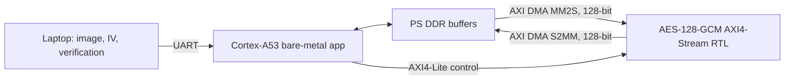

# FPGA AES-128-GCM Authenticated Image Security on ZCU104

Hardware/software co-design for authenticated image encryption on the AMD/Xilinx ZCU104 Zynq UltraScale+ MPSoC. A Cortex-A53 application transfers 256 × 256 RGB888 images through AXI DMA to a custom 128-bit AES-GCM AXI4-Stream accelerator in programmable logic.

The final implementation provides confidentiality, a 128-bit authentication tag, ciphertext-tamper detection, and controlled plaintext release. FPGA ciphertext and tags were independently checked against Python's `AESGCM` implementation.

## Verified outcome

| Test | Measured result |
|---|---:|
| Physical board | ZCU104 (`xczu7ev-ffvc1156-2-e`) |
| Toolchain | Vivado and Vitis Embedded 2026.1 |
| PL clock | 75.002 MHz |
| Image format | 256 × 256 RGB888, 196,608 bytes |
| Dataset | 10 images + 1 same-image/new-IV transaction |
| Unique 96-bit IVs | 11/11 |
| FPGA ciphertext matched Python AESGCM | 11/11 PASS |
| FPGA 128-bit tag matched Python AESGCM | 11/11 PASS |
| Exact recovery | 11/11 PASS |
| Modified ciphertext rejected | 11/11 PASS |
| Rejected output buffer zeroized | 11/11 PASS |
| Unauthenticated plaintext released | 0/11 |

## Architecture



Data path: PS DDR → AXI DMA → AES-GCM → AXI DMA → PS DDR. The processor supplies the key, 96-bit IV, direction and length through AXI4-Lite registers. On decryption, software checks the hardware authentication decision before transmitting plaintext. A rejected output buffer is zeroized.

## Measured CTR-DMA versus GCM-DMA

| Metric | AES-CTR DMA | AES-GCM DMA | GCM change |
|---|---:|---:|---:|
| Encryption latency | 2,186 µs | 3,010 µs | +37.7% |
| Encryption throughput | 89,939 KB/s | 65,318 KB/s | −27.4% |
| Decryption latency | 2,175 µs | 2,999 µs | +37.9% |
| Decryption throughput | 90,394 KB/s | 65,557 KB/s | −27.5% |
| LUTs | 17,016 | 19,593 | +15.1% |
| Flip-flops | 11,129 | 12,587 | +13.1% |
| BRAM equivalent | 5 × 36K | 5 × 36K | 0% |
| DSPs | 0 | 0 | 0 |
| WNS at 75.002 MHz | +1.304 ns | +0.187 ns | Timing met |
| Vivado estimated power | 3.539 W | 3.625 W | +2.4% |
| Ciphertext tamper detection | No | Yes | Security gain |


## Image-security measurements

Across the 10-image AES-GCM dataset:

- mean combined ciphertext entropy: **7.999052 bits/byte**;
- mean horizontal, vertical and diagonal correlations: **−0.000839**, **−0.001305**, and **+0.001588**;
- same preprocessed image with two fresh IVs: **NPCR 99.593099%**, **UACI 33.458699%**;
- all 11 IVs, tags and ciphertext hashes were unique.

These image statistics describe the measured ciphertext. Cryptographic correctness is supported more strongly by the standard RTL tests, exact Python AESGCM agreement, unique-IV checks, and authenticated tamper-rejection experiment.


## Repository layout

```text
hardware/
  rtl/                         Original AXI4-Lite CTR baseline
  gcm_dma/rtl/                 AES, GHASH and AES-GCM AXI4-Stream RTL
  gcm_dma/sim/                 NIST/reference RTL testbenches
  gcm_dma/scripts/             Self-contained Vivado 2026.1 flow
  gcm_protected_chunk/         Protected-chunk BRAM architecture and Vivado flow
software/
  vitis/                       Original fixed-image baseline
  vitis_gcm/single_image/      Dynamic authenticated-image application
  vitis_gcm/batch/             Multi-image benchmark application
  vitis_gcm/protected_chunk/   Cortex-A53 protected-chunk bare-metal application
host/gcm/                      Python single-image and batch tools
host/gcm/protected_chunk/      CHK3 32-byte header framing and host test tools
results/
  ctr_dma_run1/                Preserved CTR-DMA evidence
  gcm_batch_run1/              Preserved GCM evidence and reports
  comparison/                  Recomputed JSON summary and evidence hashes
docs/                          Security model and paper experiment plan
tools/analyze_results.py       Reproduces tables, hashes and figures
```

## Protected-chunk BRAM optimization

The protected-chunk co-design milestone eliminates external DDR release before authentication tag verification. Captured chunk ciphertext is held in an on-chip buffer (`ProtectedChunkMemory_BRAM.v`) and replayed for authentication-only calculation while output DMA is disarmed. Decryption and DMA plaintext release occur only after authentication passes.

Refactoring the protected buffer storage into a synchronous simple-dual-port memory enabled block-RAM inference, reducing protected memory utilization from 58,392 LUTs to **86 LUTs and 2 RAMB36 blocks**, while improving WNS to **+0.975 ns** at 75.002 MHz. Physical ZCU104 testing verified 100% chunk acceptance across 17×19 (1/1), 256×256 (48/48), and 512×512 (192/192) image runs.

For full architectural, protocol, and resource details, see [docs/PROTECTED_CHUNK.md](docs/PROTECTED_CHUNK.md).

## Reproduce the analysis

```powershell
py -m pip install -r requirements-analysis.txt
py tools\analyze_results.py
```

The script reads the preserved raw files, recomputes the comparison, creates SHA-256 checksums for the evidence, and regenerates the figures. It does not alter the raw measurements.

## Build and run

Follow [BUILD_AND_RUN.md](BUILD_AND_RUN.md). The short sequence is:

1. Run the RTL validation testbench.
2. Run the three Vivado scripts under `hardware/gcm_dma/scripts` (or `hardware/gcm_protected_chunk/scripts`).
3. Create a Vitis platform from the exported XSA.
4. Build the Cortex-A53 application.
5. Start the matching Python host tool before launching the Vitis application.
6. Require `OVERALL: PASS` before accepting a run.

## Documentation

- [Detailed measured results](RESULTS.md)
- [Build and run guide](BUILD_AND_RUN.md)
- [AES-GCM protected-chunk milestone](docs/PROTECTED_CHUNK.md)
- [Security model and limitations](docs/SECURITY_MODEL.md)
- [Paper experiment roadmap](docs/PAPER_EXPERIMENT_PLAN.md)
- [Machine-readable verified summary](results/comparison/verified_summary.json)

## Current limitations

- The proof of concept supports 256 × 256 RGB888 payloads (up to 512 × 512 on protected-chunk); it is not a DICOM parser.
- Additional authenticated data (AAD) limitations apply to the baseline `gcm_dma` path; the protected-chunk path incorporates CHK3 AAD framing.
- IVs are randomly generated by the host; production use needs persistent uniqueness enforcement for every key.
- The demonstration key is not stored in a secure hardware key vault.
- DDR plaintext release before tag verification applies to the baseline `gcm_dma` path; the protected-chunk path holds unauthenticated ciphertext in on-chip BRAM and releases plaintext only after authentication succeeds.
- Power values are vectorless Vivado estimates with medium confidence, not physical rail measurements.
- The present dataset has 10 images; a publication study should use a larger, licensed medical-image dataset and repeated trials.

## Academic scope

This repository is a verified engineering research prototype, not a clinical security product. The included NIST/demo key is intentionally public and must never be used as a production secret. Do not publish private patient images, real secret keys, generated Vivado workspaces, bitstreams, XSA files, or unrelated local logs. Only redistribute sample images whose licensing permits public use.

## License

See [LICENSE](LICENSE).