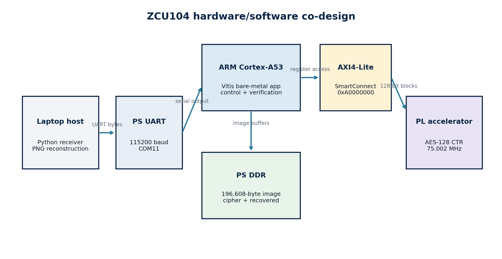
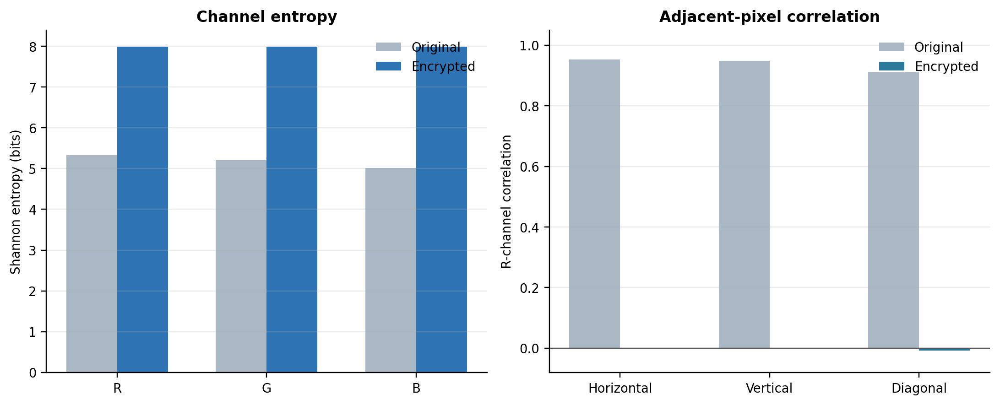

# FPGA AES-128 CTR Image Encryption on ZCU104

Hardware/software co-design for full-image AES-128 Counter (CTR) encryption and decryption on the AMD/Xilinx ZCU104 Zynq UltraScale+ MPSoC.

The ARM Cortex-A53 processing system controls a custom Verilog AES accelerator in programmable logic through AXI4-Lite. A 256 × 256 RGB888 image is encrypted and decrypted on the board, transferred to a laptop through PS UART, reconstructed as PNG, and checked byte-for-byte against the original.

## Development stages

1. AES-128 and CTR behavior were first verified with NIST SP 800-38A vectors and a small image test on the earlier FPGA baseline.
2. ZCU104 switches, LEDs, JTAG programming, and UART were checked using a small board-test design.
3. The final Zynq design integrated the Cortex-A53, AXI4-Lite, and custom AES RTL for a complete 256 × 256 real-image demonstration.
4. Timing, utilization, power estimation, throughput, entropy, correlation, histogram, and counter-sensitivity results were collected.

Existing earlier-platform source files can remain in this repository as the verified baseline; the folders documented below contain the final ZCU104 implementation.

## Demonstrated result

| Item | Result |
|---|---:|
| Board | AMD/Xilinx ZCU104 |
| Device | `xczu7ev-ffvc1156-2-e` |
| Toolchain | Vivado and Vitis Embedded 2026.1 |
| Image | 256 × 256 RGB888 |
| Payload | 196,608 bytes / 12,288 AES blocks |
| Encryption time | 34.766 ms |
| Decryption time | 34.747 ms |
| Effective throughput | 5.655 MB/s encryption; 5.658 MB/s decryption |
| Recovery | Exact byte-for-byte PASS |
| Timing | 75.002 MHz, WNS +0.342 ns, TNS 0 |
| PL utilization | 10,779 LUTs, 2,866 flip-flops |
| Power | 3.872 W Vivado estimate, medium confidence |

## Output images

| Original | AES-CTR ciphertext | Recovered |
|---|---|---|
|  |  |  |

The original and recovered raw-image SHA-256 value is:

```text
aa237d9a507990a9144c055ace0f484b3f4c055b8ce5ecd9c4da8aa18ed861e4
```

The ciphertext SHA-256 value is:

```text
20a3d2aa8fae11e68c32b35be8ecdbc957697c1fa66f4c8c302470d1d28f46ef
```

## Architecture



The image is compiled into the bare-metal application as an RGB byte array. The Cortex-A53 stores the original, encrypted, and recovered buffers in processor memory. For every 16-byte block, it writes four 32-bit words to the accelerator, starts the operation, polls `DONE`, and reads four output words.

CTR mode uses the same hardware operation for encryption and decryption:

```text
C[i] = P[i] XOR AES-128(key, counter + i)
P[i] = C[i] XOR AES-128(key, counter + i)
```

## Repository layout

```text
hardware/
  rtl/                 Custom AES-128 and AXI4-Lite Verilog
  scripts/             Reproducible Vivado 2026.1 build script
software/
  vitis/src/           Cortex-A53 bare-metal application
host/                  UART receiver and PNG reconstruction
tools/                 Image-to-RGB/header preparation utility
docs/
  images/              Architecture, results, and analysis plots
  reports/             Detailed technical report in PDF and DOCX
results/
  reports/             Vivado utilization, timing, and power reports
  metadata.json        Test-vector parameters and SHA-256 values
```

## Custom RTL modules

| Module | Responsibility |
|---|---|
| `AES_CTR_AXI_LITE` | AXI4-Lite registers, command/status control, counter management, and CTR XOR |
| `AES_128_Core` | Pipelined AES-128 forward cipher with ten rounds |
| `KeyExpansion` | Generates eleven 128-bit round keys from the original key |
| `SubBytes` | Applies the AES S-box to all 16 state bytes |
| `ShiftRows` | Permutes bytes according to the AES row shifts |
| `MixColumns` | Performs AES finite-field column mixing for rounds 1–9 |
| `AddRoundKey` | XORs the AES state with a round key |

Vivado's block design adds `zynq_ultra_ps_e_0`, `axi_smc`, `system`, and the generated `system_wrapper` top level.

## AXI4-Lite register map

The accelerator is mapped at `0xA0000000`.

| Offset | Register | Function |
|---:|---|---|
| `0x00` | CONTROL | START, LOAD_COUNTER, SOFT_RESET, CLEAR_DONE |
| `0x04` | STATUS | BUSY and DONE |
| `0x10–0x1C` | KEY | Four 32-bit words of the AES-128 key |
| `0x20–0x2C` | COUNTER | Four 32-bit counter words |
| `0x30–0x3C` | DATA_IN | One 128-bit plaintext or ciphertext block |
| `0x40–0x4C` | DATA_OUT | One 128-bit result block |

## Build and run

Detailed instructions are in [BUILD_AND_RUN.md](BUILD_AND_RUN.md).

Quick outline:

1. Run `hardware/scripts/build_zcu104_hardware_2026_1.tcl` in the Vivado Tcl console.
2. Import the generated XSA into a Vitis platform for `psu_cortexa53_0`, standalone OS.
3. Create an empty application and add the files under `software/vitis/src`.
4. Build the platform and application.
5. Start `py host/receive_full_image.py COM11` on the laptop.
6. Launch the Vitis application on the board.
7. Confirm `Original == recovered: PASS`.

## Security analysis

The returned ciphertext achieved 7.9991 bits/byte combined Shannon entropy and adjacent-pixel correlations close to zero. Changing one bit of the initial counter produced 99.6262% byte-level NPCR, 33.5052% UACI, and a 49.9736% ciphertext bit-change rate.



These image statistics support the absence of visible structure, but they do not replace standardized cryptographic validation.

## Current limitations

- AES-CTR provides confidentiality but does not provide authentication or tamper detection.
- The fixed key and counter are demonstration values. A deployed design must use secure key storage and a unique counter/nonce for every message under the same key.
- AXI4-Lite moves each data block using multiple processor transactions, limiting throughput.
- The current image is compiled into the application; it is not uploaded dynamically.
- The demonstration uses RGB pixels, not a complete DICOM parser or clinical workflow.
- Power is a vectorless Vivado estimate, not a physical board-rail measurement.

## Planned improvements

- AXI4-Stream data interface and AXI DMA between PS DDR and PL
- AES-GCM authentication with GHASH and tag verification
- Unique 96-bit nonce generation and storage
- Real DICOM Pixel Data support with authenticated metadata
- ARM software versus AXI-Lite versus DMA performance comparison
- Physical power measurement and larger multi-image dataset evaluation

## Documentation

- [Technical report (PDF)](docs/reports/ZCU104_AES_CTR_Technical_Report.pdf)
- [Viva and interview guide](docs/INTERVIEW_GUIDE.md)
- [Measured implementation results](RESULTS.md)
- [GitHub Desktop upload instructions](docs/GITHUB_DESKTOP_UPLOAD.md)

## Academic scope

This repository is a verified engineering proof of concept. It should not be represented as a clinical security product. The included sample image should only be redistributed when its licensing or ownership permits public use.

