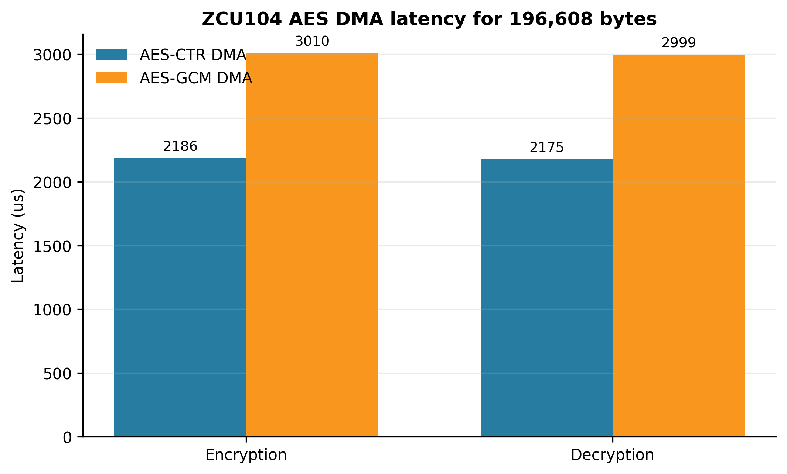
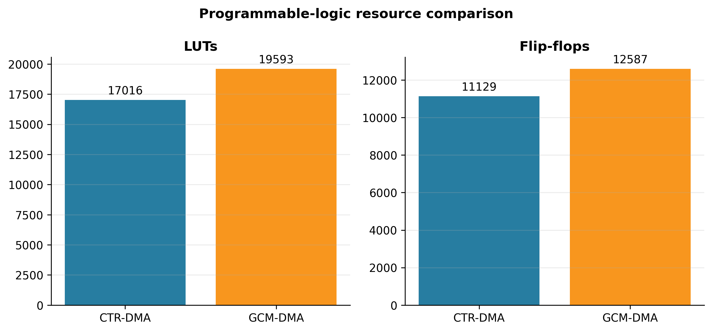

# Verified Experimental Results

All values in this document come from the raw files under `results/`. Run `py tools/analyze_results.py` to recreate the comparison CSV, evidence hashes and figures.

## 1. AES-GCM functional verification

The physical-board batch contained 10 dataset images and one repeat of the first image with a new IV, for 11 transactions.

| Verification | Result |
|---|---:|
| Unique IVs | 11/11 PASS |
| FPGA ciphertext equals Python AESGCM ciphertext | 11/11 PASS |
| FPGA tag equals Python AESGCM tag | 11/11 PASS |
| Valid tags accepted by board | 11/11 PASS |
| Original equals authenticated recovery | 11/11 PASS |
| One-bit-modified ciphertext rejected by board | 11/11 PASS |
| Modified ciphertext rejected by Python AESGCM | 11/11 PASS |
| Rejected output buffers zeroized | 11/11 PASS |
| Unauthenticated plaintext release | 0/11 |

The UART transcript ends with:

```text
All unique IVs: PASS
All FPGA ciphertexts match Python: PASS
All FPGA tags match Python: PASS
All recoveries: PASS
All board tamper rejections: PASS
All rejected buffers zeroized: PASS
OVERALL: PASS
```

## 2. Performance

Each transaction processed 196,608 bytes at a 75.002 MHz programmable-logic clock.

| Measurement | CTR-DMA | GCM-DMA |
|---|---:|---:|
| Encryption time | 2,186 µs | 3,010 µs |
| Encryption throughput | 89,939 KB/s | 65,318 KB/s |
| Decryption time | 2,175 µs | 2,999 µs |
| Decryption throughput | 90,394 KB/s | 65,557 KB/s |

The GCM encryption latency increased by 37.7% and throughput decreased by 27.4% relative to CTR-DMA because GCM additionally computes GHASH and the authentication tag.

Whole-microsecond summaries show zero standard deviation because every image has the same payload length and timings are rounded. The raw 100 MHz counter in the GCM transcript still records a small encryption range of 0.36 µs and a decryption range of 0.09 µs.



## 3. Implementation results

| Measurement | CTR-DMA | GCM-DMA |
|---|---:|---:|
| Clock | 75.002 MHz | 75.002 MHz |
| Period | 13.333 ns | 13.333 ns |
| WNS | +1.304 ns | +0.187 ns |
| TNS | 0 ns | 0 ns |
| LUTs | 17,016 | 19,593 |
| Flip-flops | 11,129 | 12,587 |
| BRAM equivalent | 5 × 36K | 5 × 36K |
| DSPs | 0 | 0 |
| Estimated total power | 3.539 W | 3.625 W |
| Estimated dynamic power | 2.847 W | 2.932 W |
| Estimated static power | 0.693 W | 0.693 W |

GCM added 2,577 LUTs and 1,458 flip-flops over CTR-DMA. Timing passed for both designs. Power is a vectorless Vivado estimate with medium confidence.



## 4. Ciphertext statistics

The following GCM values are calculated only across the 10 dataset images. The additional 11th transaction is reserved for IV sensitivity.

| Metric | Mean | Population SD | Minimum | Maximum |
|---|---:|---:|---:|---:|
| Combined entropy (bits/byte) | 7.999052 | 0.000109 | 7.998874 | 7.999200 |
| Horizontal correlation | −0.000839 | 0.002813 | −0.006264 | +0.004292 |
| Vertical correlation | −0.001305 | 0.004891 | −0.009902 | +0.006824 |
| Diagonal correlation | +0.001588 | 0.004141 | −0.005454 | +0.009134 |
| Histogram chi-square | 258.377 | 29.388 | 218.302 | 306.490 |

## 5. IV sensitivity

The same preprocessed input image was encrypted twice with two distinct 96-bit IVs.

| Measurement | Result |
|---|---:|
| Different IVs | PASS |
| Different authentication tags | PASS |
| Different ciphertext SHA-256 hashes | PASS |
| Ciphertext NPCR | 99.593099% |
| Ciphertext UACI | 33.458699% |

This measures ciphertext sensitivity to IV selection. It is not a plaintext-avalanche test.

## 6. Security interpretation

The controlled CTR experiment demonstrated malleability: modifying one ciphertext bit modified the corresponding recovered plaintext bit without detection. GCM rejected the same class of modification because the authentication tag failed. The application did not transmit the rejected buffer and zeroized it.

The central engineering trade-off is therefore measurable: approximately 27% lower throughput and 15% more LUTs provide authenticated encryption and controlled plaintext release.

## 7. Protected-chunk BRAM optimization

The protected-chunk milestone introduces an on-chip buffer (`ProtectedChunkMemory_BRAM.v`) to store chunk ciphertext before authentication, eliminating external DDR release pre-verification.

Refactoring the protected buffer memory to a synchronous simple-dual-port BRAM primitive dramatically reduced programmable-logic utilization:

| Metric | LUT baseline | BRAM optimized |
|---|---:|---:|
| Protected memory LUTs | 58,392 | 86 |
| RAMB36 | 0 | 2 |
| RAMB18 | 0 | 0 |
| WNS | +0.313 ns | +0.975 ns |
| WHS | +0.013 ns | +0.002 ns |
| Total power | 4.000 W | 3.602 W |
| Dynamic power | 3.305 W | 2.909 W |
| Static power | 0.696 W | 0.693 W |

Physical ZCU104 board validation verified complete exact recovery and tamper rejection across chunked workloads:
- **17×19 payload**: 1/1 chunk PASS
- **256×256 payload**: 48/48 chunks PASS
- **512×512 payload**: 192/192 chunks PASS

Physical raw evidence remains local and is not committed in this documentation update. Measured validation values are transcribed into the documentation and must not be altered. See [docs/PROTECTED_CHUNK.md](docs/PROTECTED_CHUNK.md) for full protocol and implementation documentation.

## 8. Evidence locations

- `results/gcm_batch_run1/raw/`: 11-run CSV, JSON summaries and UART transcript
- `results/gcm_batch_run1/reports/`: GCM timing, utilization and power reports
- `results/ctr_dma_run1/raw/`: CTR benchmark and controlled tamper experiment
- `results/ctr_dma_run1/reports/`: CTR timing, utilization and power reports
- `results/comparison/verified_summary.json`: recomputed results plus SHA-256 evidence manifest